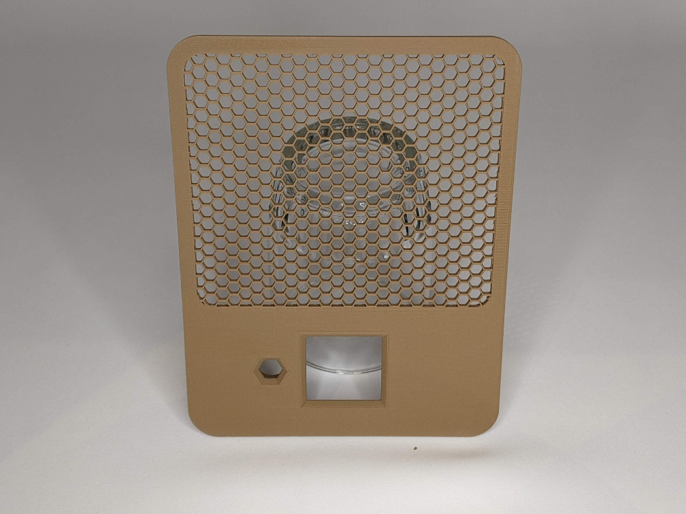
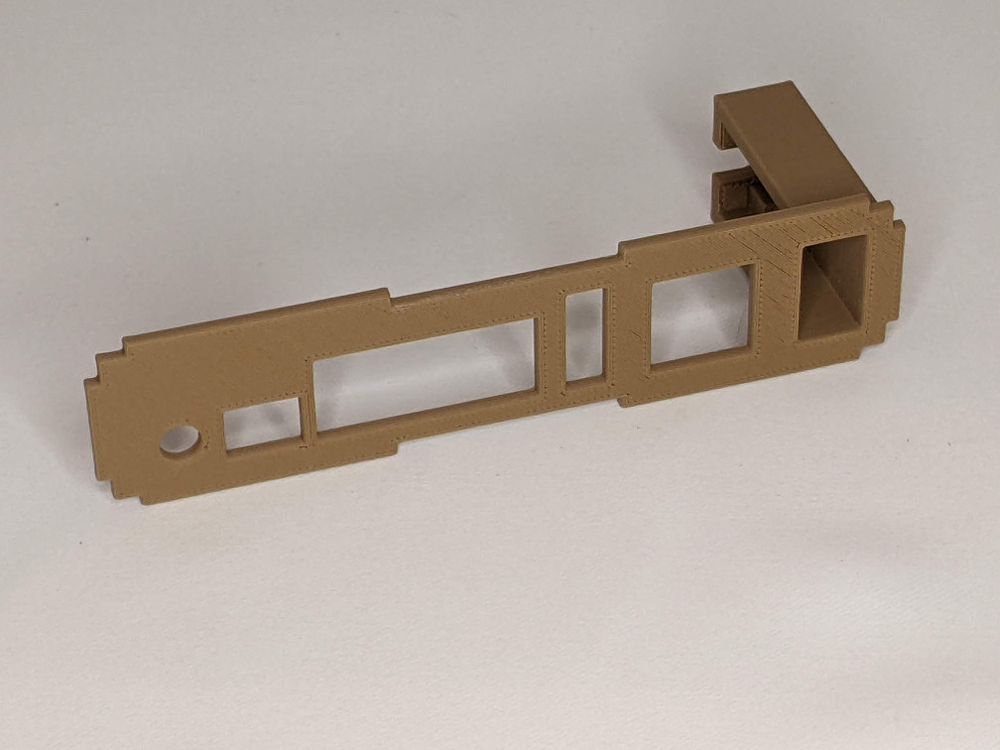
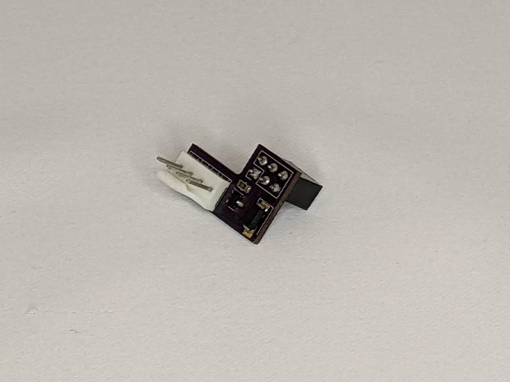
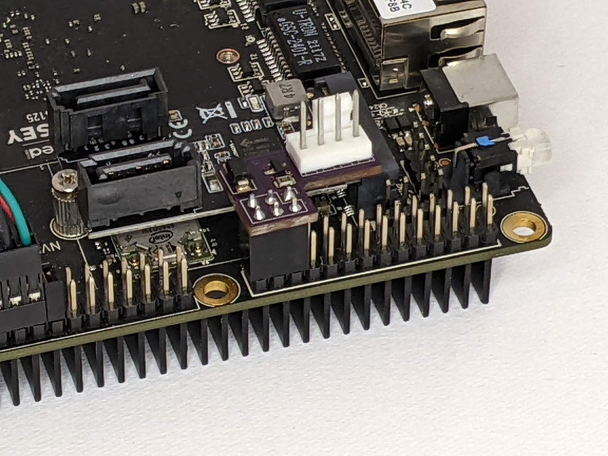
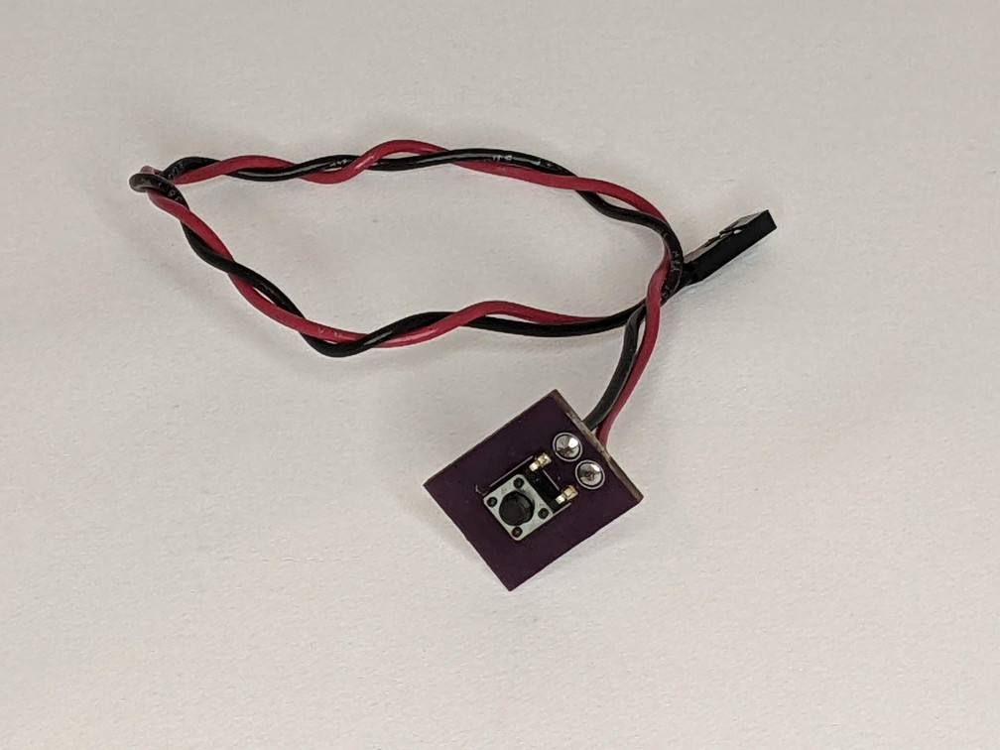
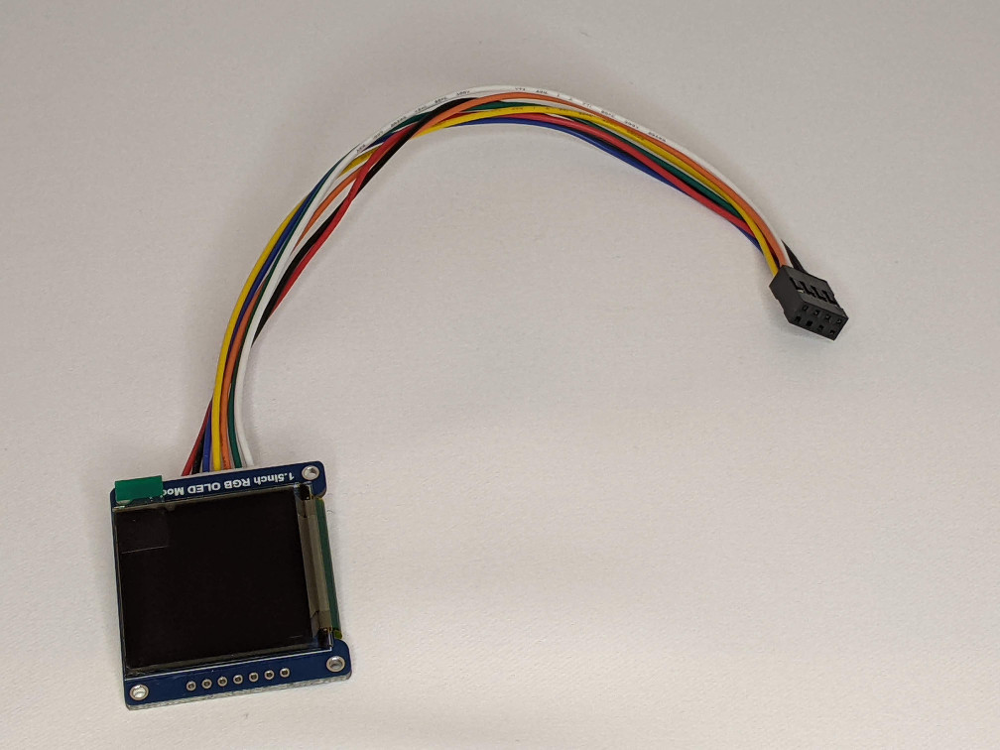
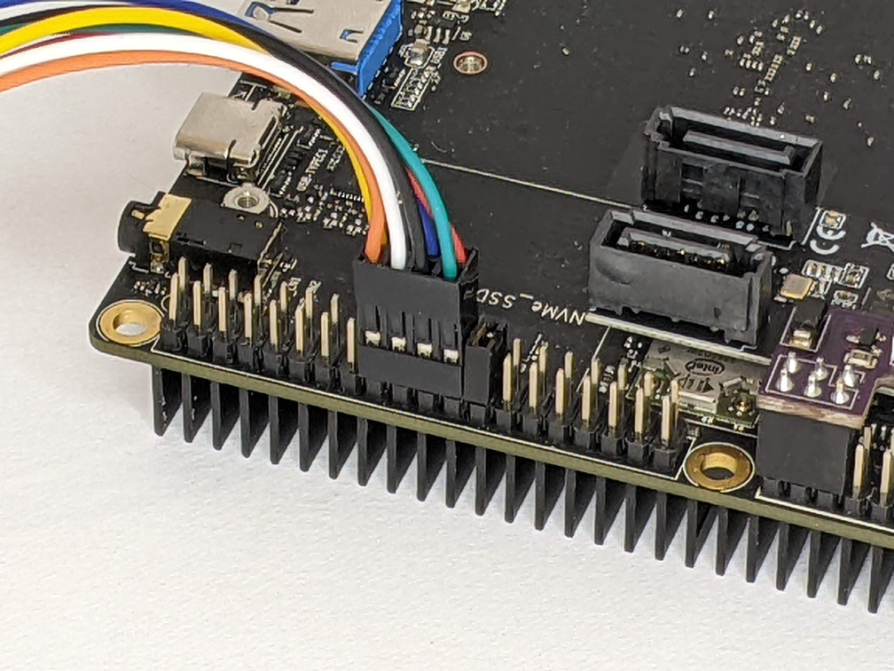
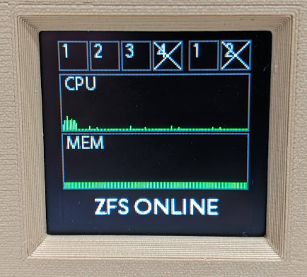
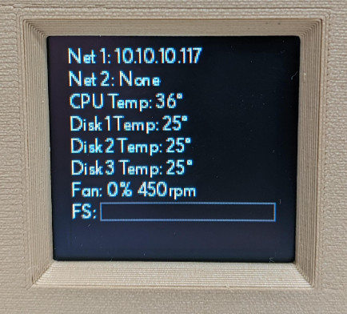

# NASOdyssey

## Introduction

This page and repository documents my design and build of a small NAS server inspired by (but not a fork of) [this project](https://github.com/mattlokes/onash2).
This NAS is a gift for my father who has modest needs, but I've expanded on Matt's project in a number of ways:

* A different main board since the ODroid H2 is no longer available
* 3 drives rather than 2 for use with a ZFS array
* A color OLED display running over SPI for faster, more colorful status screens

The NAS runs [OpenMediaVault](https://www.openmediavault.org/) and [Docker](https://www.docker.com/) and provides file sharing and basic app server functionality.

The final case measures 6" wide, 7.25" high, and 8.25" deep. The rubber feet on the bottom add about 0.5" to the height.

## Index

* [Parts](#parts)
* [Case](#case)
* [Hardware](#hardware)
* [Electronics](#electronics)
  * [Arduino](#arduino)
  * [OLED](#oled)
* [Assembly](#assembly)
* [Software](#software)
  * [ArduinoFan](#arduinofan)
  * [Sysmon](#sysmon)
* [Picures](#pictures)

## Parts

This is a fairly complete parts list, excluding the [3D printed parts](#case) and [nuts and bolts](#hardware) which are detailed further down. Some substituions are possible.

| Item | Quantity | Notes |
| ---- | -------- | ----- |
| [Odyssey X86J4125864](https://www.seeedstudio.com/ODYSSEY-X86J4125864-p-4916.html) | 1 | Includes 64GB eMMC and 8GB RAM |
| [SATA power/data cable](https://www.seeedstudio.com/SATA-26AWG-200mm-p-4680.html) | 3 | |
| [3.5" SATA drive](https://smile.amazon.com/gp/product/B08VH891FS) | 3 | I used 2TB drives but you can go larger |
| [SATA Expander](https://smile.amazon.com/gp/product/B07XYSK3QG) | 1 | Adds 2 more SATA ports to the 1 already on the main board |
| [120mm 5V PWM fan](https://smile.amazon.com/gp/product/B07DXQTCK6) | 1 | Needs to be a 5V fan! Installed to blow **out** the back |
| [OLED display](https://smile.amazon.com/gp/product/B07DBXMFSN) | 1 | This is a 1.5" RGB SPI display |
| [USB 3 extension](https://smile.amazon.com/gp/product/B08FLB9Q1N) | 1 | I only used the "right" handed extension |
| [12V power supply](https://smile.amazon.com/gp/product/B00Z9X4GLW) | 1 | This is a 10A supply which is a little overkill, but you need enough juice to get 3 HDD spinning |

## Case

The case is designed in [FreeCAD](https://www.freecadweb.org/) and all the 3D parts are exported as STLs.
The FreeCAD file also contains basic models for all all the various non-printed parts and an assembly model to test
fits. I'm fairly new to FreeCAD so I don't claim to be an expert and I apologize for any bad choices I may have made
in the modeling.

The parts are printed in 3 different materials: PETG, PLA, and TPU. PETG (Overture) was chosen for the parts that have direct
contact with the hard drives since they can get quite warm. I used wood PLA (Hatchbox) for everything else because I wanted
the matte finish and the warmer feeling of the wood. This is the first project I've ever used wood PLA so it gave me an
excuse to upgrade my printer's nozzle to an Olsson Ruby. I love the wood PLA so far. The TPU (SainSmart) is clear and used
for a small power button to extend the Odyssey's stupid power button.

The table below gives some printing detail on each part. Unless noted otherwise, infill is 15% gyroid.

| Part | Material | Supports | Weight (g) | Time | Notes |
| ---- | -------- | -------- | ------ | ---- | ----- |
| LowerDriveBracket x2 | PETG | No | 30 | 2.5h |
| UpperDriveBracket x2 | PETG | No | 10 | 1h |
| UpperShell  | PLA | No  | 228 | 22h | |
| LowerShell  | PLA | No  | 189 | 17h  | Honeycomb infill for LowerShellGrill |
| FrontPanel  | PLA | No  | 43  | 3.5h | Honeycomb infill for FrontPanelGrill, extra perimeters around screw holes |
| RearPanel   | PLA | No  | 35  | 2.5h | Honeycomb infill for RearPanelGrill |
| CapShell    | PLA | No  | 85  | 5.5h | |
| CapCutout   | PLA | No  | 12  | 1h   | |
| IOPanel     | PLA | Yes | 12  | 1.5h | |
| OLEDCover   | PLA | No  | 6   | 35m  | |
| FrontButton | PLA | Yes | 2   | 11m  | |
| PowerButton | TPU | No  | <1  | 1m   | Increase perimeters so effectively 100% concentric infill |

All told, it's about 2.5 days of printing. If it matters, I'm using a Prusa MK3S and PrusaSlicer.

### Additional notes

The LowerShell, FrontPanel, and BackPanel parts each have an additional associated part and STL. In PrusaSlicer, you can load
these additional STLs as part modifiers and specify different printing parameters for those volumes. I specified a honeycomb infill
and zerod out the top and bottom layers. This gives the effect of an open grill as can be seen in the picture.

The power button on the Odyssey is a bit strange. It's mounted to the main board such that it doesn't protrude beyond the edge of
the PCB. This is a problem when mounting the board in a case. I needed the power button to be accessible through the IOPanel,
so the printed button, with a dab of super-glue, is pressed into the button on the Odyssey. It's printed in clear TPU so the
LED in the power button shines through the printed button.

The IOPanel is pressed into the RearPanel and sort of snaps into place. You can add some glue if you think you need it. I made
the IOPanel a seperate piece so I could iterate the design and get the cutouts just right. The far side of the IOPanel includes
a structure that the USB extension cable pushes into. This setup gets the USB 3 port to the back panel where it's used for
an external backup drive.

## Hardware

All the nuts and bolts were purchased from BoltDepot and Amazon.

| Item | Quantity | Used for |
| [M3x20 machine screw](https://www.boltdepot.com/Controls/6836) | 8 | Mainboard and drive assembly |
| [M3x12 machine screw](https://www.boltdepot.com/Controls/6833) | 11 | Drive brackets, cap, and cap cutout |
| [M3 hex nut](https://www.boltdepot.com/Controls/4773) | 19 | All the above |
| [4mm washer](https://www.boltdepot.com/Controls/4514) | 6 | Main rods |
| [M4 hex nut](https://www.boltdepot.com/Controls/4774) | 12 | Main rods |
| [\#6x3/8" machine screw](https://www.boltdepot.com/Controls/1335) | 12 | Drives to drive brackets |
| [\#2x1/8" sheet metal screw](https://www.boltdepot.com/Controls/9862) | 4 | OLEDCover |
| [4mm x 180mm threaded rods](https://smile.amazon.com/gp/product/B01LWPOZFV) | 6 | Upper/lower shell connection |

There is a 6x25mm light spring used behind the FrontButton to give it a little better feel. It's not required. I don't
know where to get this spring because I already had a bunch in my stocks. Try your local hardware store.

I used [these rubber feet](https://smile.amazon.com/gp/product/B07R55S3NS/) on the bottom of the case.

The main rods I got from Amazon are actually "studs" in that they are not completely threaded. You only need threads on the last 5mm of each
end so you can substitute fully threaded rods if you need to.

## Electronics

There are 2 custom PCBs used in this project. All the circuit design and PCB layout is done is [KiCad](https://www.kicad.org/).
The gerber files have been exported and are part of the repository. All the PCBs use surface mount components because I have
that capability. There's nothing really special about the designs and components used. You could probably roll your own
designs with through-hole components and tweek the 3D prints a little to compensate.

I had my boards made at [OSHPark](https://oshpark.com/) and I include a project link for each one to allow you to
order your own. These boards were small enough to automatically get upgraded (i.e., free upgrade after you submit)
to their "Super Swift" service. I use OSPark for all my projects requiring PCBs.

### ArduinoConnector

[OSHPark Project](https://oshpark.com/shared_projects/e7hUICRE)

This PCB connects to the Odyssey's built-in Arduino Zero header and is used to control the 120mm case fan. It provides a
standard 4 pin fan connector. The fan can be a PWM or non-PWM type, but must be 5V (not the more common 12V variety).
The only 5V PWM fan I could find on Amazon was the Noctua fan linked in the [Parts](#parts) section.
It is not a cheap fan. Noctua also makes a non-PWM version for a little less, but it may still be the most expensive
fan you'll ever buy.

| Component | Footprint | LCSC Part | Mouser Part |
| --------- | --------- | --------- | ----------- |
| Transistor | SOT-23   | MMBT100   | |
| Resistor   | \0805     |           | |
| Diode      | SMA      | 1N5819    | |
| Arduino header | 2.54mm 2x3 |           | |
| Fan header |          |           | |

### ButtonBoard

[OSHPark Project](https://oshpark.com/shared_projects/wWtjVivs)

The ButtonBoard just has a single surface mount button on it with holes for wires. The wires go to a 2 position female header
that plugs into pins 39 and 40 of the Raspberry Pi compatible header on the Odyssey board. Polarity doesn't matter.
The button mounts in the FrontPanel and provides a way for the user to select which status screen is displayed on the OLED
display (but could be used for anything if you change the software).

| Component | Footprint | LCSC Part | Mouser Part |
| --------- | --------- | --------- | ----------- |
| Button    | SMD       | TS665TP | |
| Female header | 2.54mm 1x2 |    | |
| Female header pins | n/a |      | |

### OLED

The OLED display comes with a wiring harness. I removed the individual female headers on the ends of the wires and snapped the
ends into an 8 position (2x4) female header. The header plugs into the Raspberry Pi header on the Odyssey so that it connects
to the SPI port.

You can see a 2 position jumper plugged into the header in the picture above. The only purpose of the jumper is to tell me
where to plug in the OLED display. It can be left in place since it just connects 2 unused IO pins.

## Assembly

TODO

## Software

There are 2 main pieces of software for this project (other than OpenMediaVault itself and docker).

### ArduinoFan

This is the firmware for the embedded Arduino Zero. See the README in the repository for more information on compiling
and uploading.

The firmware provides a serial interface that can be used to control a fan plugged into the ArduinoConnector PCB.
As described in the README, the code will respond to a **DUTYCYCLE** command which will turn on the fan and set it's speed
through PWM. If a non-PWM fan is used, it will simply turn on at full speed.

The code will turn the fan on full speed when it starts. The [Sysmon](#sysmon) code will adjust it's speed when it's
fully started.

### Sysmon

This software and it's associated libraries are written in python and are meant to be run using the python docker image that
can be built from the python-image directory in the repository. The sysmon.py script (and libraries) are not actually **in**
the docker image, but should rather be externally mounted in a docker volume. See the included docker-compose file for how
I accomplish that. This allows the image to be used for other scripting purposes as needed.

As written, the sysmon.py script provides 2 status screens, selectable using the push button on the front of the case.
The first, default, screen shows drive and network activity lights in the top row, a CPU usage graph below that, a memory
usage graph below that, and the ZFS pool health as a text message at the bottom.

The drive activity lights show both reads (top half) and writes (bottom half) for each drive in the array as well as an
external drive plugged into the USB 3 port. If the USB drive isn't plugged in, the corresponding activity light has an "X"
displayed. If there are S.M.A.R.T. issues on a drive, the activity lights go from their default green to orange. If ZFS
decides a drive is not OK, the background of the activity light is red.

There are 2 network activities, one for each ethernet port. They show both transmits (top half) and receives (bottom half)
and an "X" if no network address is assigned.

The graphs update every second with the most recent measurement on the right side. They also shade from green to red as
usage goes up.

The second status screen shows the addresses assigned to each network port, CPU and drive temperatures, and file system
usage for the main ZFS pool.

All of this is changeable if you're willing to do a little coding.

## Pictures
