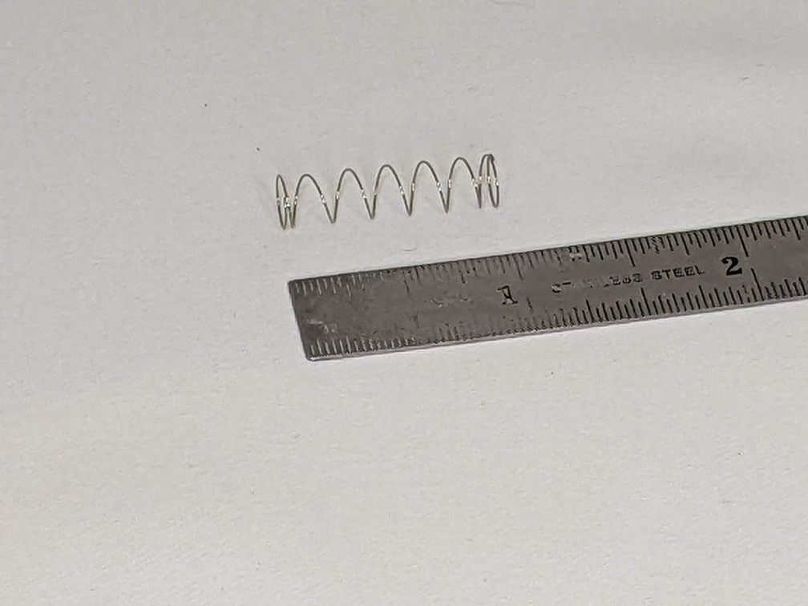

## Introduction

This page and repository documents my design and build of a small NAS server inspired by (but not a fork of) [this project](https://github.com/mattlokes/onash2).
This NAS is a gift for my father who has modest needs, but I've expanded on Matt's project in a number of ways:

* A different main board since the ODroid H2 is no longer available
* 3 drives rather than 2 for use with a ZFS array
* A color OLED display running over SPI for faster, more colorful status screens

The NAS runs [OpenMediaVault](https://www.openmediavault.org/) and [Docker](https://www.docker.com/) and provides file sharing and basic app server functionality.

The final case measures 6" wide, 7.25" high, and 8.25" deep. The rubber feet on the bottom add about 0.5" to the height.

## Index

* [Parts](#parts)
* [Case](#case)
* [Hardware](#hardware)
* [Electronics](#electronics)
  * [Arduino](#arduino)
  * [OLED](#oled)
* [Software](#software)
  * [ArduinoFan](#arduinofan)
  * [Sysmon](#sysmon)
* [Assembly](#assembly)

## Parts

This is a fairly complete parts list, excluding the [3D printed parts](#case), [nuts and bolts](#hardware), and some [electronic](#electronics) bits, all of which are detailed further down. Some substituions are possible.

| Item | Quantity | Notes |
| ---- | -------- | ----- |
| [Odyssey X86J4125864](https://www.seeedstudio.com/ODYSSEY-X86J4125864-p-4916.html) | 1 | Includes 64GB eMMC and 8GB RAM |
| [SATA power/data cable](https://www.seeedstudio.com/SATA-26AWG-200mm-p-4680.html) | 3 | The mainboard power connectors are non-standard so these were expedient |
| [3.5" SATA drive](https://smile.amazon.com/gp/product/B08VH891FS) | 3 | I used 2TB drives but you can go larger |
| [SATA Expander](https://smile.amazon.com/gp/product/B07XYSK3QG) | 1 | Adds 2 more SATA ports to the 1 already on the main board |
| [120mm 5V PWM fan](https://smile.amazon.com/gp/product/B07DXQTCK6) | 1 | Needs to be a 5V fan! Installed to blow **out** the back |
| [OLED display](https://smile.amazon.com/gp/product/B07DBXMFSN) | 1 | This is a 1.5" RGB SPI display |
| [USB 3 extension](https://smile.amazon.com/gp/product/B08FLB9Q1N) | 1 | I only used the "right" handed extension |
| [12V power supply](https://smile.amazon.com/gp/product/B00Z9X4GLW) | 1 | This is a 10A supply which is a little overkill, but you need enough juice to get 3 HDD spinning |

## Case

The case is designed in [FreeCAD](https://www.freecadweb.org/) and all the 3D parts are exported as STLs.
The FreeCAD file also contains basic models for all all the various non-printed parts and an assembly model to test
fits. I'm fairly new to FreeCAD so I don't claim to be an expert and I apologize for any bad choices I may have made
in the modeling.

The parts are printed in 3 different materials: PETG, PLA, and TPU. PETG (Overture) was chosen for the parts that have direct
contact with the hard drives since they can get quite warm. I used wood PLA (Hatchbox) for all the externally visible parts because
I wanted the matte finish and the warmer feeling of the wood. This is the first project I've ever used wood PLA so it gave me an
excuse to upgrade my printer's nozzle to an Olsson Ruby. I love the wood PLA so far. The TPU (SainSmart) is clear and used
for a small power button to extend the stupid one on the Odyssey board.

The table below gives some printing detail on each part. Unless noted otherwise, infill is 15% gyroid.

| Part                 | Material | Platform | Supports | Weight (g) | Time | Notes |
| ----                 | -------- | -------- | -------- | ---------- | ---- | ----- |
| LowerDriveBracket x2 | PETG     | Smooth   | No       | 30         | 2.5h |       |
| UpperDriveBracket x2 | PETG     | Smooth   | No       | 10         | 1h   |       |
| UpperShell           | PLA      | Smooth   | No       | 228        | 22h  |       |
| LowerShell           | PLA      | Smooth   | No       | 189        | 17h  | Honeycomb infill for LowerShellGrill |
| FrontPanel           | PLA      | Textured | No       | 43         | 3.5h | Honeycomb infill for FrontPanelGrill, extra perimeters around screw holes |
| RearPanel            | PLA      | Textured | No       | 35         | 2.5h | Honeycomb infill for RearPanelGrill |
| CapShell             | PLA      | Textured | No       | 85         | 5.5h |       |
| CapCutout            | PLA      | Textured | No       | 12         | 1h   |       |
| IOPanel              | PLA      | Textured | Yes      | 12         | 1.5h |       |
| OLEDCover            | PLA      | Smooth   | No       | 6          | 35m  | This could be printed in anything since it's inside and not visible |
| FrontButton          | PLA      | Textured | Yes      | 2          | 11m  |       |
| PowerButton          | TPU      | Smooth   | No       | <1         | 1m   | Increase perimeters so effectively 100% concentric infill |

All told, it's about 2.5 days of printing. If it matters, I'm using a Prusa MK3S and PrusaSlicer.

### Additional notes

The LowerShell, FrontPanel, and BackPanel parts each have an additional associated part and STL. In PrusaSlicer, you can load
these additional STLs as part modifiers and specify different printing parameters for those volumes. I specified a honeycomb infill
and zeroed out the top and bottom layers. This gives the effect of an open grill as can be seen in the picture.

The FrontPanel has 4 small holes on the back, arranged around the place where the OLEDCover installs. Those holes should have
threads cut into them by heating up the #2 sheet metal screws and screwing them into the holes. Let the screws cool down then
remove them.

The power button on the Odyssey is a bit strange. It's mounted to the main board such that it doesn't protrude beyond the edge of
the PCB. This is a problem when mounting the board in a case. I needed the power button to be accessible through the IOPanel,
so the printed button, with a dab of super-glue, is pressed into the button on the Odyssey. It's printed in clear TPU so the
LED in the power button shines through the printed button. See the [Assembly](#assembly) section.

The IOPanel is pressed into the RearPanel and sort of snaps into place. You can add some glue if you think you need it. I made
the IOPanel a seperate piece so I could iterate the design and get the cutouts just right. The far side of the IOPanel includes
a structure that the USB extension cable pushes into. This setup gets the USB 3 port to the back panel where it's used for
an external backup drive.

## Hardware

All the nuts and bolts were purchased from BoltDepot and Amazon.

| Item                                                                        | Quantity | Used for |
| ----                                                                        | -------- | -------- |
| [M3x20 machine screw](https://www.boltdepot.com/Controls/6836)              | 8        | Mainboard and drive assembly |
| [M3x12 machine screw](https://www.boltdepot.com/Controls/6833)              | 11       | Drive brackets, cap, and cap cutout |
| [M3 hex nut](https://www.boltdepot.com/Controls/4773)                       | 19       | All the above |
| [M4 hex nut](https://www.boltdepot.com/Controls/4774)                       | 12       | Main rods |
| [\#6x3/8" machine screw](https://www.boltdepot.com/Controls/1335)           | 12       | Drives to drive brackets |
| [\#2x1/8" sheet metal screw](https://www.boltdepot.com/Controls/9862)       | 4        | OLEDCover |
| [4mm x 180mm threaded rods](https://smile.amazon.com/gp/product/B01LWPOZFV) | 6        | Upper/lower shell connection |
| [Rubber feet](https://smile.amazon.com/gp/product/B07R55S3NS/)              | 4        | |
| Small zip tie                                                               | 1        | Securing the USB extension |

There is a 6x25mm light spring used behind the FrontButton to give it a little better feel. It's not required. I don't
know where to get this spring because I already had a bunch in my stocks. Try your local hardware store.

The main rods I got from Amazon are actually "studs" in that they are not completely threaded. You only need threads on the last 5mm of each end so you can substitute fully threaded rods if you need to.

## Electronics

There are 2 custom PCBs used in this project. All the circuit design and PCB layout is done is [KiCad](https://www.kicad.org/).
The gerber files have been exported and are part of the repository. All the PCBs use surface mount components because I have
that capability. There's nothing really special about the designs and components used. You could probably roll your own
designs with through-hole components and tweek the 3D prints a little to compensate.

I had my boards made at [OSHPark](https://oshpark.com/) and I include a project link for each one to allow you to
order your own. These boards were small enough to automatically get upgraded (i.e., free upgrade after you submit)
to their "Super Swift" service. I use OSHPark for all my projects requiring PCBs.

### ArduinoConnector

[OSHPark Project](https://oshpark.com/shared_projects/e7hUICRE)

This PCB connects to the Odyssey's built-in Arduino Zero header and is used to control the 120mm case fan. It provides a
standard 4 pin fan connector. The fan can be a PWM or non-PWM (3 pin) type, but must be 5V (not the more common 12V variety).
The only 5V PWM fan I could find on Amazon was the Noctua fan linked in the [Parts](#parts) section.
It is not a cheap fan. Noctua also makes a non-PWM version for a little less, but it may still be the most expensive
fan you'll ever buy.

| Component                       | LCSC Part | Mouser Part |
| ---------                       | --------- | ----------- |
| NPN transistor, MMBT100, SOT-23 | [C274690](https://lcsc.com/product-detail/Bipolar-Transistors-BJT_onsemi-MMBT100_C274690.html) | [512-MMBT100](https://www.mouser.com/ProductDetail/onsemi-Fairchild/MMBT100?qs=UMEuL5FsraBwiKQ1WMrjpg%3D%3D) |
| 330 ohm Resistor, 0805          | [C1852181](https://lcsc.com/product-detail/Chip-span-style-background-color-ff0-Resistor-span-Surface-Mount_BOURNS-CR0805-FX-3300ELF_C1852181.html) | [652-CR0805FX-3300ELF](https://www.mouser.com/ProductDetail/Bourns/CR0805-FX-3300ELF?qs=sGAEpiMZZMvdGkrng054t%2Fh5BnJxeWSzcKgeG4ZYXHA%3D) |
| Diode, 1N5819, SMA              | [C437199](https://lcsc.com/product-detail/Schottky-Barrier-Diodes-SBD_KEXIN-1N5819_C437199.html) |  |
| Arduino header, 2.54mm 2x3      | [C92272](https://lcsc.com/product-detail/Female-Headers_CONNFLY-Elec-DS1023-2-3SF11_C92272.html) | [571-5-534998-3](https://www.mouser.com/ProductDetail/TE-Connectivity/5-534998-3?qs=xDp7PGUNC%252BsJzaB%252By1YUEg%3D%3D) |
| Fan header                      |              | [538-47053-1000](https://www.mouser.com/ProductDetail/538-47053-1000) |

There's nothing special about the transistor or diode I used. Almost any NPN transistor capable of handling 300mA would do. Same
for the diode but maybe a little more current handling, say 1A. I just used parts I had on hand.

The Arduino header is just a common 2x3 through-hole female header. You can probably get them on Amazon too.

The green rectangle in the image below shows where the PCB plugs into the header.

### ButtonBoard

[OSHPark Project](https://oshpark.com/shared_projects/wWtjVivs)

The ButtonBoard just has a single surface mount button on it with holes for wires. The wires go to a 2 position female connector
that plugs into pins 39 and 40 of the Raspberry Pi compatible header on the Odyssey board. Polarity doesn't matter.
The button mounts in the FrontPanel and provides a way for the user to select which status screen is displayed on the OLED
display (but could be used for anything if you change the software).

| Component                 | LCSC Part | Mouser Part |
| ---------                 | --------- | ----------- |
| Button, TS665TP           | [C412375](https://lcsc.com/product-detail/Tactile-Switches_SHOU-HAN-TS665TP_C412375.html)   | [769-EVP-BT4A4A000](https://www.mouser.com/ProductDetail/Panasonic/EVP-BT4A4A000?qs=CiayqK2gdcJLoreobld9qQ%3D%3D)            |

The button from Mouser is not the same part as from LCSC (which is the one I used). I **think** it will work given the dimensions of
the solder pads and switch body/stem, but I'm not 100% sure. It might require a different footprint on the PCB.

The female connector is a commonly available "Dupont" connector. I found one with wires ready attached in my box of
miscellaneous wires and connectors from various PC builds.

The lower green rectangle in the image in the [OLED](#oled) section shows where the connector plugs into the header.

### OLED

The OLED display comes with a wiring harness. I removed the individual female headers on the ends of the wires and snapped the
ends into an 8 position (2x4) female "Dupont" connector I had from a set of connector I bought on Amazon.
The header plugs into the Raspberry Pi header on the Odyssey so that it connects to the SPI port.

The upper green rectangle in the image below shows where the connector plugs into the header.

You can see a 2 position jumper plugged into the header in the picture above. The only purpose of the jumper is to tell me
where to plug in the OLED display. It can be left in place since it just connects 2 unused IO pins.

## Software

There are 2 main pieces of software for this project (other than OpenMediaVault itself and docker).

### ArduinoFan

This is the firmware for the embedded Arduino Zero. See the README in the repository for more information on compiling
and uploading.

The firmware provides a serial interface that can be used to control a fan plugged into the ArduinoConnector PCB.
As described in the README, the code will respond to a **DUTYCYCLE** command which will turn on the fan and set it's speed
through PWM. If a non-PWM fan is used, it will simply turn on at full speed.

The code will turn the fan on full speed when it starts. The [Sysmon](#sysmon) code will adjust it's speed when it's
fully started.

### Sysmon

This software and it's associated libraries are written in python and are meant to be run using the python docker image that
can be built from the python-image directory in the repository. The sysmon.py script (and libraries) are not actually **in**
the docker image, but should rather be externally mounted in a docker volume. See the included docker-compose file for how
I accomplish that. This allows the image to be used for other scripting purposes as needed.

As written, the sysmon.py script provides 2 status screens, selectable using the push button on the front of the case.
The first, default, screen shows drive and network activity lights in the top row, a CPU usage graph below that, a memory
usage graph below that, and the ZFS pool health as a text message at the bottom.

The drive activity lights show both reads (top half) and writes (bottom half) for each drive in the array as well as an
external drive plugged into the USB 3 port. If the USB drive isn't plugged in, the corresponding activity light has an "X"
displayed. If there are S.M.A.R.T. issues on a drive, the activity lights go from their default green to orange. If ZFS
decides a drive is not OK, the background of the activity light is red.

There are 2 network activities, one for each ethernet port. They show both transmits (top half) and receives (bottom half)
and an "X" if no network address is assigned.

The graphs update every second with the most recent measurement on the right side. They also shade from green to red as
usage goes up.

The second status screen shows the addresses assigned to each network port, CPU and drive temperatures, and file system
usage for the main ZFS pool.

All of this is changeable if you're willing to do a little coding.

## Assembly

Before assembly, you should probably bench wire the mainboard and hard drives and get the OS and software installed and running. You
don't have to but it's better to find out now if something isn't working.

Gather all the printed parts, hardware, and assembled electronics together and follow along.

Prepare the LowerShell
: With the bottom of the LowerShell facing up, press 4 M3 nuts into the corresponding hex holes in the shell. Do the
same with 6 M4 nuts in the holes near the edges of the shell. Be careful when pressing the nuts in. Make sure you have
support under the shell so you don't snap it. I use a small block of wood under the shell, up against the plastic underneath
and a small phillips screw driver in the hole of each nut to press down. Press 4 M3 nuts into the slots on the insides
of the drive assembly mounting posts. Use a M3x20 machine screw to make sure each nut is aligned with its hole.

Prepare the UpperShell
: Like the LowerShell, press 7 M3 nuts into the corresponding hex holes on the inside of the shell.

Assemble the front panel
: Place the OLED display into the recess on the back/inside of the front panel making sure to remove the stuck on screen
protector first. Place the FrontButton printed part in the button hole, the spring into the back of the button, and then
the ButtonBoard PCB into the recess with the wires sticking straight up. Put the wires through the oval hole in the
OLEDCover part and slide the OLEDCover down into place and secure with 4 #2 sheet metal screws.

Install the USB extension cable
: Put the female end of the right handed USB extension cable into the recess of the IOPanel. The hole is chamfered to
allow it to fit. It should press in with a little force. Use the small zip tie around the extension cable up against the
IOPanel to prevent the extension cable from pulling out of the back of the panel. You may not need this zip tie if the
extension fits tightly enough.

Assemble the back panel
: Press the IOPanel into the castellated slots in the back of the RearPanel. It should sort of snap into place. If it's loose,
use some hot glue or CA glue to secure it. Don't actually screw the 120mm fan to the back of the panel as pictured yet; you'll need it out of the way
in some of the next steps.

Install the RearPanel into the LowerShell
: Slide the RearPanel into the slot at the back of the LowerShell and make sure it's fully seated.

Prepeare the mainboard
: Install the M.2 SATA expander in the M.2 slot farthest from the built in SATA port. The built in SATA port will end up
being /dev/sda. The SATA port on the expander closest to the built in port will be /dev/sdb, and the last port will be
/dev/sdc. With a dab of CA clue, glue the PowerButton into the power button on the back of the mainboard. Don't put any
glue on the center-back of the button because you don't want it to stick the LED inside the power button.

Install the mainboard
: Place the Odyssey mainboard on the four posts in the LowerShell and slide it so the rear ports go through the
corresponding cutouts in the IOPanel. Drop 4 M3x20 machine screws into the holes in the corner of the mainboard
and tighten them down. Plug the USB extension into the USB 3 port on the front of the mainboard.

Install the ArduinoConnector PCB
: Plug the PCB into the Arduino header. Plug the 120mm fan into the fan header on the ArduinoConnector but don't
screw the fan in yet.

Install the FrontPanel into the LowerShell
: Slide the FrontPanel into the slot at the front of the LowerShell and make sure it's fully seated. Plug the OLED and button cables
into the Raspberry Pi header.

Tidy up the wiring
: Make sure all the wiring is tidy and tucked in. Use some zip ties if you have to.

Prepare the UpperDriveBrackets
: Press 4 M3 nuts into the corresponding hex holes in the UpperDriveBrackets, 2 for each bracket.

Assemble the drive assembly
: Using the #6x3/8" machine screws, mount the LowerDriveBrackets to the right hand side of the hard drives (when looking at the
front of the drives). Mount the UpperDriveBrackets to the left side. When looking at the front of the drives, I put labels on them.
Plug the SATA power/data cables into the backs of the drives.

Install the drive assembly
: This is the trickiest part since space is tight. Keep a eye on connectors and nudge them as necessary.
Place the drive assembly into the LowerShell so the LowerDriveBrackets go over the posts on the sides of the LowerShell.
While doing this, plug the drive's SATA data connectors into the M.2 SATA expander ports keeping in mind which drive will be
"2" and which will be "3". Route the SATA power and data cables and plug them into the ports on the mainboard. Tidy up
the wireing and use zip ties if necessary. Drop 4 M3x20 machine screws into the holes in the LowerDriveBrackets and tighten
them down. No you can install the 120mm fan using the screws provided with the fan. I intended the fan to blow out the back of the case.

Power up and test
: At this point, you shold power up and make sure the drives, fan, and OLED are working. Shut it down when you're done.

Install main rods
: Drop each of the 6 4mm rods through the holes in the LowerShell and screw them into the nuts that were pressed into the bottom
of the LowerShell. I screwed them in so they came past the bottom of the shell, put a dab of Loctite on the threads, then
unscrewed them so they were flush with the bottom of the shell.

Install the UpperShell
: Slide the UpperShell down on the main rods and front/back panels until the rods come out of the top of the UpperShell. There is
a front and back to the UpperShell; 4 of the holes in the shell should line up with the UpperDriveBrackets.
Put the 6 4mm nuts on the exposed rods and tighten them down. Be careful not to tighten them so much you crush the
plastic shell. You'll see 4mm washers on the rods in the photo but I opted to remove them as they interfered with the CapShell.
Put 4 M3x12 machine screws through the holes and into the UpperDriveBrackets and tighten them down.

Install the CapShell
: Place the CapShell on top of the UpperShell. Drop 6 M3x12 machine screws through holes and tighten them down. Place the
CapCutout in the center and secure it with the last M3x12 screw.

Install the rubber feet
: Flip the case over and stick the rubber feet on the bottom. Turn it upright again and you're done!

